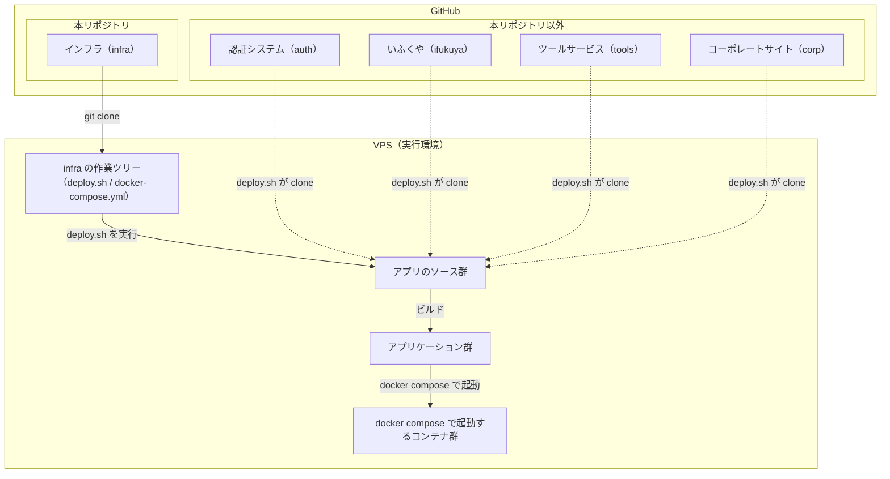
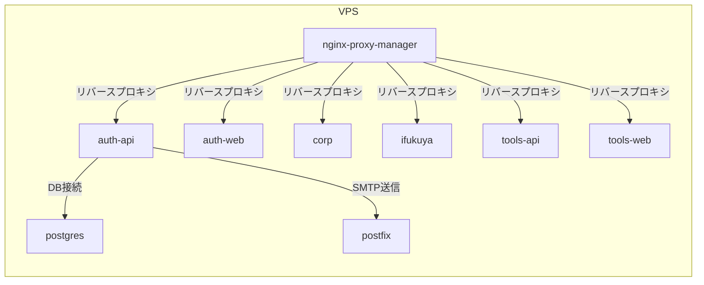

# アーキテクチャ - Waddle Inc. インフラリポジトリ

このファイルでは、インフラの全体構成（ディレクトリ構成・サービス構成・ネットワーク構成・ルーティング）をまとめています。

> 図の記述には [Mermaid](https://mermaid.js.org/) を使用しています。GitHub や Mermaid 対応エディタ（Obsidian 等）で閲覧すると図が正しく表示されます。

## 目次

<!-- toc -->

- [概要](#%E6%A6%82%E8%A6%81)
- [ディレクトリ構成](#%E3%83%87%E3%82%A3%E3%83%AC%E3%82%AF%E3%83%88%E3%83%AA%E6%A7%8B%E6%88%90)
- [サービス一覧](#%E3%82%B5%E3%83%BC%E3%83%93%E3%82%B9%E4%B8%80%E8%A6%A7)
- [サービス間依存関係](#%E3%82%B5%E3%83%BC%E3%83%93%E3%82%B9%E9%96%93%E4%BE%9D%E5%AD%98%E9%96%A2%E4%BF%82)
- [ルーティング](#%E3%83%AB%E3%83%BC%E3%83%86%E3%82%A3%E3%83%B3%E3%82%B0)
- [ネットワーク構成](#%E3%83%8D%E3%83%83%E3%83%88%E3%83%AF%E3%83%BC%E3%82%AF%E6%A7%8B%E6%88%90)
- [ポート一覧](#%E3%83%9D%E3%83%BC%E3%83%88%E4%B8%80%E8%A6%A7)
  - [公開ポート](#%E5%85%AC%E9%96%8B%E3%83%9D%E3%83%BC%E3%83%88)
  - [非公開ポート](#%E9%9D%9E%E5%85%AC%E9%96%8B%E3%83%9D%E3%83%BC%E3%83%88)

<!-- tocstop -->

## 概要

本番 VPS では、まず `waddle-inc/infra` を clone して作業ツリー（例: `~/waddle-inc/infra/`）を用意し、`deploy.sh` で別リポジトリのアプリソースを取得したうえで、`docker-compose.yml` に従ってコンテナを起動します。アプリのソースは別管理ですが、配置と起動の定義は `waddle-inc/infra` に集約されています。



## ディレクトリ構成

各アプリケーションはサブディレクトリ単位で管理し、`docker-compose.yml` から参照されます。

```
~/waddle-inc/infra/
├── auth/                        ← 認証システム（waddle-inc/auth）
├── corp/                        ← コーポレートサイト（waddle-inc/corp）
├── ifukuya/                     ← いふくや（waddle-inc/ifukuya）
├── tools/                       ← ツールサービス（waddle-inc/tools）
├── .env                         ← 環境変数（手動配置）
├── deploy.sh                    ← デプロイスクリプト
└── docker-compose.yml           ← コンテナ構成定義
```

次のディレクトリは、`deploy.sh` によりそれぞれ対応するリポジトリから clone されます。

- `auth/`
- `corp/`
- `ifukuya/`
- `tools/`

## サービス一覧

Docker Compose で管理するコンテナの一覧です。

| サービス名          | イメージ / ビルド                 | 役割                             |
| ------------------- | --------------------------------- | -------------------------------- |
| nginx-proxy-manager | jc21/nginx-proxy-manager          | リバースプロキシ・SSL 終端       |
| postgres            | postgres                          | 認証システム API 用 DB           |
| postfix             | boky/postfix                      | SMTP メール送信（DKIM 署名付き） |
| auth-api            | ローカルビルド（auth/apps/api/）  | 認証システム API                 |
| auth-web            | ローカルビルド（auth/apps/web/）  | 認証システム WEB                 |
| corp                | ローカルビルド（corp/）           | コーポレートサイト               |
| ifukuya             | ローカルビルド（ifukuya/）        | いふくや静的サイト               |
| tools-api           | ローカルビルド（tools/apps/api/） | ツールサービス API               |
| tools-web           | ローカルビルド（tools/apps/web/） | ツールサービス WEB               |

## サービス間依存関係

各サービスがどのサービスに依存しているかを示します。



`auth-api` は `postgres`・`postfix` のヘルスチェック通過後に起動します（`depends_on: condition: service_healthy`）。`tools-api` は `auth-api` のヘルスチェック通過後に起動します（`depends_on: condition: service_healthy`）。

## ルーティング

nginx-proxy-manager により以下のドメインがコンテナに転送されます。

| ドメイン                 | 転送先         |
| ------------------------ | -------------- |
| auth.waddle-inc.com      | auth-web:3000  |
| tools.waddle-inc.com     | tools-web:3001 |
| waddle-inc.com           | corp:3002      |
| api.auth.waddle-inc.com  | auth-api:8000  |
| api.tools.waddle-inc.com | tools-api:8001 |
| ifukuya.waddle-inc.com   | ifukuya:8080   |

## ネットワーク構成

コンテナは用途別に 3 つの Docker ネットワークに分離されています。

| ネットワーク | 種別                    | 参加サービス                                                                 |
| ------------ | ----------------------- | ---------------------------------------------------------------------------- |
| proxy        | bridge                  | nginx-proxy-manager, auth-api, auth-web, ifukuya, tools-api, tools-web, corp |
| smtp         | bridge（172.28.0.0/16） | postfix, auth-api                                                            |
| db           | bridge                  | postgres, auth-api                                                           |

`auth-api` は `proxy`・`smtp`・`db` の 3 つのネットワークに参加します。`postgres` は `db` ネットワークのみに参加し、`auth-api` 以外からのアクセスをネットワークレベルで遮断しています。

## ポート一覧

### 公開ポート

nginx-proxy-manager がリバースプロキシとして管理します。

| ポート | 用途                         |
| ------ | ---------------------------- |
| 80     | HTTP（nginx-proxy-manager）  |
| 443    | HTTPS（nginx-proxy-manager） |

### 非公開ポート

外部には公開せず、SSH ポートフォワーディング経由でアクセスします。

| ポート | 用途                        | アクセス方法                                |
| ------ | --------------------------- | ------------------------------------------- |
| 81     | nginx-proxy-manager 管理 UI | `ssh -L 8081:localhost:81 <VPS>` でアクセス |
