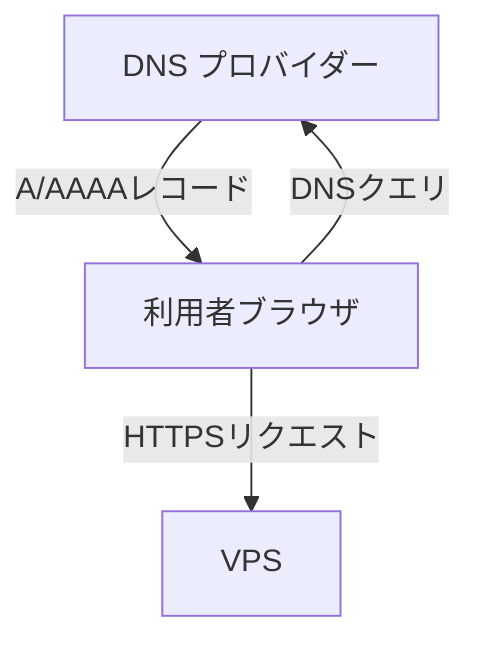

# プラットフォームと依存関係 - Waddle Inc. インフラリポジトリ

このファイルでは、外部サービス・サービス間インタラクション・運用前提ポリシー・依存関係をまとめています。

> 図の記述には [Mermaid](https://mermaid.js.org/) を使用しています。GitHub や Mermaid 対応エディタ（Obsidian 等）で閲覧すると図が正しく表示されます。

## 目次

<!-- toc -->

- [前提基盤](#%E5%89%8D%E6%8F%90%E5%9F%BA%E7%9B%A4)
- [サービス間インタラクション図](#%E3%82%B5%E3%83%BC%E3%83%93%E3%82%B9%E9%96%93%E3%82%A4%E3%83%B3%E3%82%BF%E3%83%A9%E3%82%AF%E3%82%B7%E3%83%A7%E3%83%B3%E5%9B%B3)
- [運用前提ポリシー](#%E9%81%8B%E7%94%A8%E5%89%8D%E6%8F%90%E3%83%9D%E3%83%AA%E3%82%B7%E3%83%BC)
- [依存関係](#%E4%BE%9D%E5%AD%98%E9%96%A2%E4%BF%82)

<!-- tocstop -->

## 前提基盤

インフラ運用に必要な外部サービスの一覧と管理責任を示します。ドメインのレジストラ管理と権威 DNS の実運用管理はドメインレジストラ / DNS プロバイダーを利用します。

| サービス                              | 用途                              | 管理責任                                                                       |
| ------------------------------------- | --------------------------------- | ------------------------------------------------------------------------------ |
| VPS プロバイダー                      | サーバーホスティング              | サーバー起動・停止、ネットワーク情報の確認                                     |
| ドメインレジストラ / DNS プロバイダー | ドメインレジストラ・権威 DNS 管理 | ドメイン契約更新、DNS レコード管理、メール関連 TXT レコード管理（SPF/DKIM 等） |

## サービス間インタラクション図

外部サービス間のリクエストフローを示します。

## 運用前提ポリシー

このインフラの運用において前提とするルールです。

- DNS は DNS プロバイダーの管理画面で一元管理します。
- DNS プロバイダーは DNS 解決用途（DNS Only）として利用し、HTTP プロキシ/CDN 機能は利用しません。
- メール送信に必要な SPF・DKIM の TXT レコードは DNS プロバイダーの管理画面で管理します。
- 機密情報（認証情報・鍵・トークン）はこのドキュメントに記載しません。

## 依存関係

外部サービスが停止・失効した場合の影響範囲を示します。

- DNS プロバイダーの DNS が利用不可の場合、各ドメインの名前解決ができません。
- VPS が停止した場合、サービスは停止します。
- ドメイン契約（ドメインレジストラ / DNS プロバイダー）が失効した場合、ドメイン継続利用ができません。
